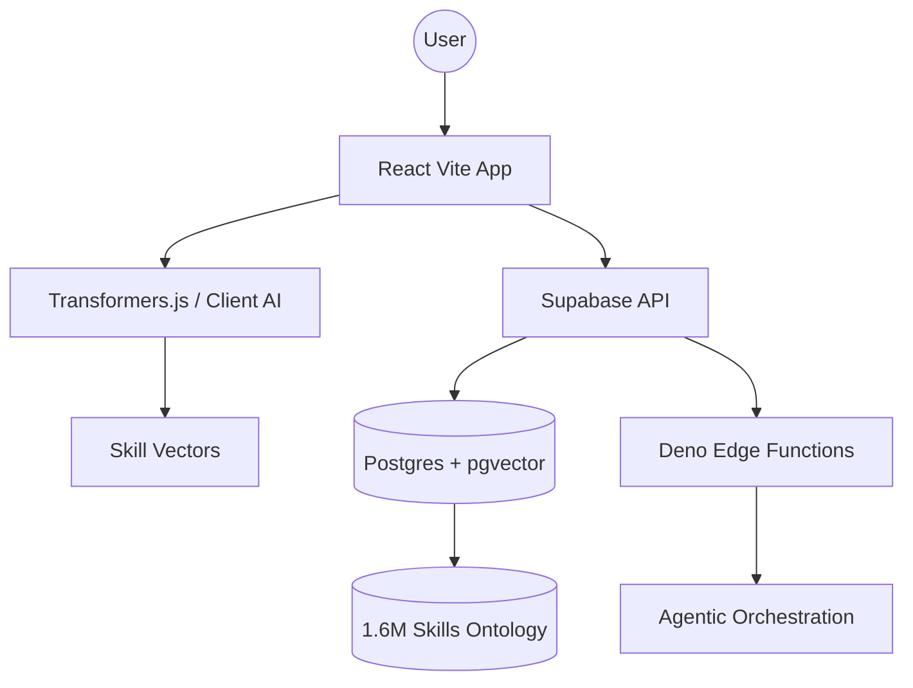

# HireLoom Talent Intelligence Platform 💫

> A production-ready, open-source clone of Eightfold AI's core business logic.

## 🚀 Overview
HireLoom leverages **Vector Embeddings** and **Agentic AI** to match talent with opportunities. Built exclusively on the Supabase stack with zero external AI dependencies.

## 🏗️ Architecture


## 🛠️ Tech Stack
- **Frontend**: React, TailwindCSS, Recharts, Framer Motion.
- **Backend**: Supabase (Postgres, Auth, Edge Functions).
- **AI/ML**: Transformers.js, compromise.js, ml.js.
- **Vector Search**: pgvector (Cosine Similarity).

## 📥 Setup Instructions

### 1. Environment Variables
Create a `.env` file:
```env
VITE_SUPABASE_URL=your-project-url
VITE_SUPABASE_ANON_KEY=your-anon-key
```

### 2. Database Initialization
Run the migrations in `./supabase/migrations`:
```bash
npx supabase db push
```

### 3. Seed Skills Data
Run the skills import script to populate the ontology from O*NET datasets.

## 📂 Repository Structure
- `/src`: React source code (Dashboard, Sourcing, CareerHub).
- `/supabase/migrations`: SQL schema with pgvector indexes.
- `/supabase/functions`: Deno Edge Functions for matching and agent logic.
- `/ai-models`: Local ONNX models for embeddings.

## ⚖️ License
Open source under the MIT License. No vendor lock-in.
